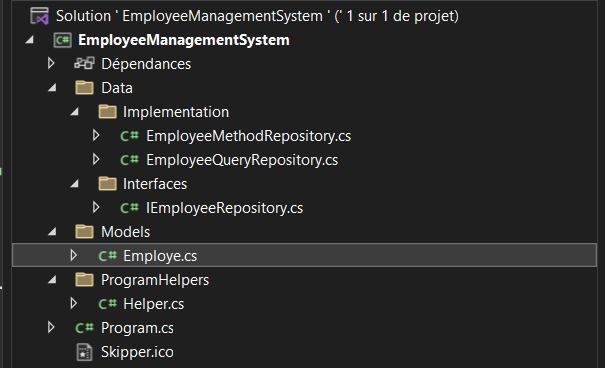
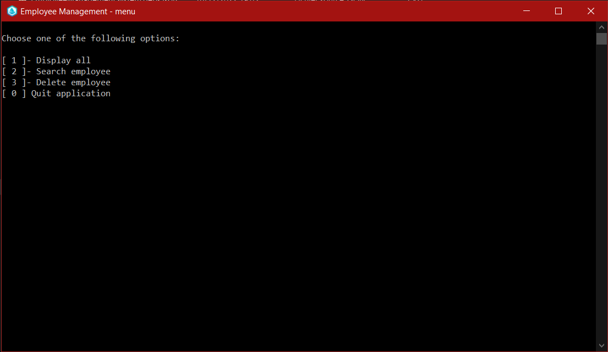
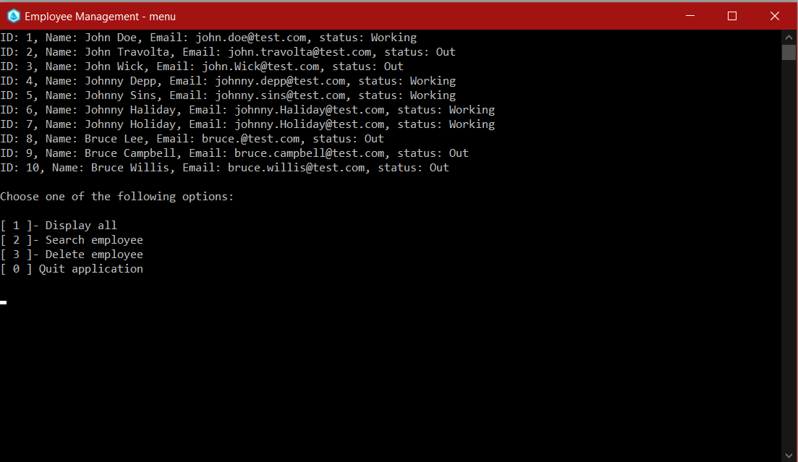
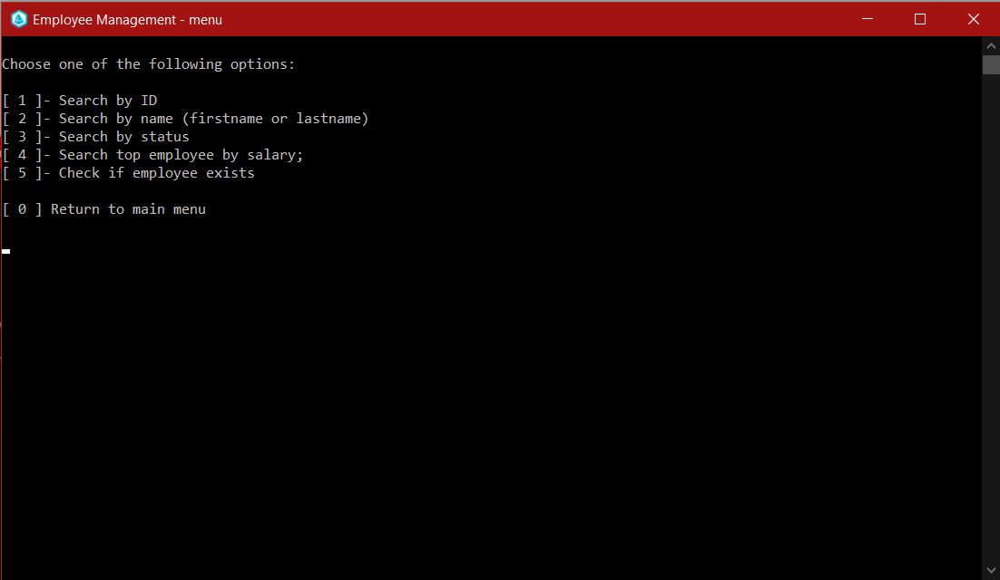
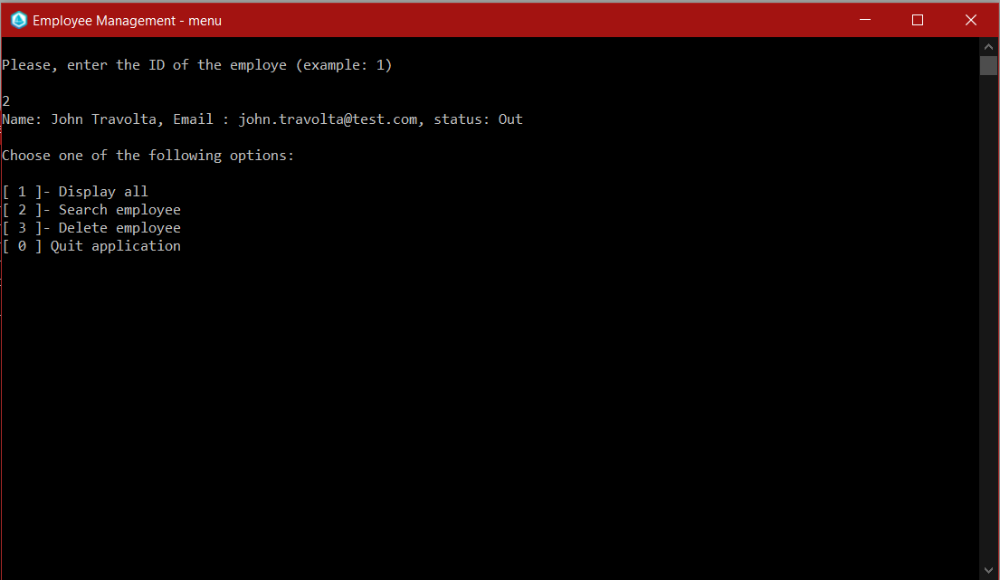
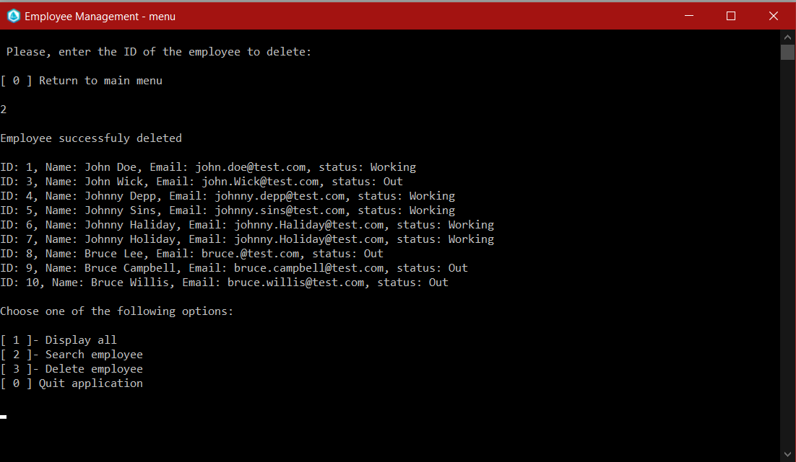

<h1 style="color:purple; text-align:center">Employee  Management System Console</h1>
<h2>Description</h2>

E.M.S. or Employee Management System is a console application which allows users to get, search and delete an existing collection of employee.

/ ! \ 

Note that each time the application is launched, 10 employees will always be created by default.

 

## Progrmaming language

:point_right:C#

 

<h2 style="margin-right:10px">Technologies: </h2>
<ul>
    <li>:star2:Collection</li>
    <li>:star2:LinQ</li>
    <li>:star2:Object Oriented Programming</li>
</ul>

 

<h2 style="margin-right:10px">Folder structure: </h2>

 

 
<h2 style="margin-right:10px">Overview: </h2>

 

